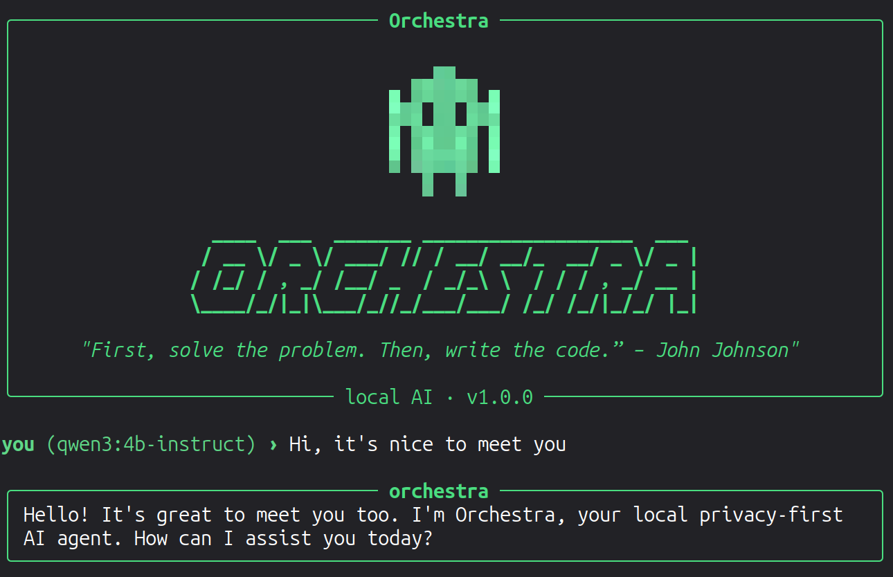

<div align="center">
  <h1>Orchestra</h1>
  <p><i>A beautifully crafted, privacy-first, local AI agent powered by Ollama.</i></p>
  
  
</div>

---

## Overview
Orchestra is a local, terminal-native AI agent designed for developers who want the power of systems like Claude Code or Cursor, but demand **100% privacy** and zero cloud dependencies. 

Powered entirely by [Ollama](https://ollama.com/), Orchestra operates directly on your machine. It can explore your codebase, reason about problems, execute bash commands, and write code—all within a stunning Terminal User Interface (TUI).

## Features

- **100% Local & Private:** No API keys, no subscriptions, and your code never leaves your machine.
- **Agentic Tool Loop:** Orchestra doesn't just chat. It uses tools to autonomously read files, list directories, and explore your codebase.
- **Built-in Terminal (`!`):** Run bash commands directly in the chat (e.g. `!git status`). The output is instantly displayed and seamlessly injected into the AI's memory.
- **Context Injection (`/add`):** A blazing-fast, lightweight RAG alternative. Type `/add path/to/file.py` to instantly feed specific files into the AI's context window.
- **Mood Switching (`/mood`):** Toggle between **Action Mode** (full tool execution) and **Plan Mode** (locked down, reasoning/architecting only).
- **Persistent Memory & Goals:** Use `/goal` and `/tasks` to track long-term tasks. Orchestra remembers your active goals across sessions.
- **Gorgeous TUI:** Built with `prompt_toolkit` and `rich`, featuring custom ASCII art, native syntax highlighting (Monokai), and an interactive context-window memory map.
- **Permission Gate:** Dangerous actions are caught by a security gate, requiring your explicit `y/n` approval before execution.

---

## Getting Started

### Prerequisites
1. **Python 3.10+** installed on your system.
2. **Ollama** installed and running. ([Download Ollama here](https://ollama.com/download)).

### 1. Download a Model
Orchestra relies on local models. Before running it, pull a model using Ollama.
*If you are running on a CPU-only machine, we highly recommend a 1.5B parameter model for speed.*

```bash
# Recommended for standard machines / laptops (4B parameters)
ollama pull qwen3:4b-instruct

# Recommended for CPU-only or older machines (1.5B parameters)
ollama pull qwen2.5:1.5b
```

### 2. Installation
Clone the repository and set up a virtual environment:

```bash
git clone https://github.com/TheAhsanFarabi/orchestra.git
cd orchestra

# Create and activate a virtual environment
python3 -m venv .venv
source .venv/bin/activate

# Install Orchestra and its dependencies
pip install -e .
```

---

## Usage

To start Orchestra, simply run:
```bash
orchestra
```

### Slash Commands
Inside the Orchestra TUI, type `/` to access the command menu:

| Command | Description |
|---|---|
| `/help` | Show the help menu |
| `/mood` | Toggle between **Action** and **Plan** mode |
| `/add <file>` | Inject a specific file into the AI's context for the next prompt |
| `/model <name>` | Switch the active Ollama model (e.g., `/model qwen2.5:1.5b`) |
| `/tasks` | View and manage your task list |
| `/goal set <text>` | Set an overarching goal for the AI to focus on |
| `/memory` | View your context window usage and a visual map of the conversation |
| `/clear` | Clear the screen and reset the conversation history |

### Terminal Commands
You can execute standard host commands without leaving the chat by prefixing them with `!`.
```bash
you › ! ls -la
you › ! git diff
you › ! npm run test
```
The output of these commands is silently added to the AI's context, so your very next message can be *"fix the error in those test results"* and Orchestra will know exactly what to do.

---

## Architecture
- **Core Loop:** The agent uses an iterative tool-call loop (`loop.py`) with a safety cutoff to prevent infinite hallucination loops.
- **UI:** The TUI is powered by `prompt_toolkit` for history/autocomplete and `rich` for markdown rendering, panels, and live spinners.
- **Skills:** Stored in `~/.orchestra/SKILL.md` and `GOALS.md`, allowing the system prompt to adapt to long-term user objectives dynamically.

## Contributing
Contributions are welcome! Whether it's adding new tools (like Git integration), improving the UI, or optimizing the LLM prompts, feel free to open a Pull Request.
